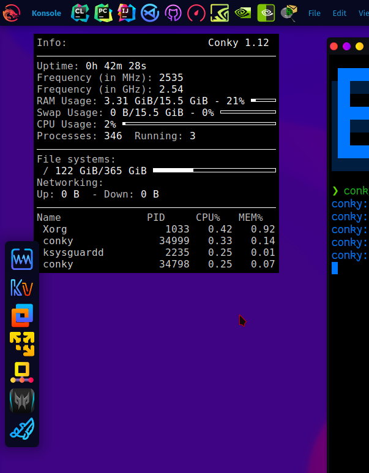

# Guide For <a href="https://github.com/brndnmtthws/conky"></a> Installation And  Customization

#### Conky Is a System Monitoring tool that Displays Hardware Information(i.g CPU, RAM, SWAP, GPU, SSD usage, etc.. ), can be customized as You like

## Installation

- Ubuntu/Debian (All Debian-based ) `sudo apt install -y conky`
- Garuda/ArchLinux (All ArchLinux-Based ) `sudo pacman -S conky`
- Fedora `sudo dnf install -y conky`
- OpenSUSE `sudo zypper install conky`
- CentOS
```
sudo yum install -y epel-release
sudo yum install -y conky
```
To run Conky open up terminal `conky` OR via Application Launcher 

### and here's conky 


