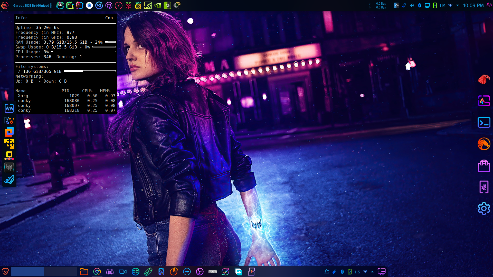

# Guide For <a href="https://github.com/brndnmtthws/conky"></a> Installation And  Customization

#### Conky Is a System Monitoring tool that Displays Hardware Information(i.g CPU, RAM, SWAP, GPU, SSD usage, etc.. ), can be customized as You like

## Installation

- Ubuntu/Debian (All Debian-based ) `sudo apt install -y conky`
- Garuda/ArchLinux (All ArchLinux-Based ) `sudo pacman -S conky`
- Fedora `sudo dnf install -y conky`
- OpenSUSE `sudo zypper install conky`
- CentOS
```
sudo yum install -y epel-release
sudo yum install -y conky
```
To run Conky open up terminal `conky` OR via Application Launcher 

### and here's conky 



#### Oh, Conky looks so bad! No problem, we will customize it. We make it out of the box.

## [Conky Customization](https://wiki.archlinux.org/title/conky)
#### Here's [Conky Objects](http://conky.sourceforge.net/variables.html), we need it for Customization.
create configFIle for conky `.conf` let name it `conky.conf` and init `conky.conf`.
and here's configFile, you can change Variables as you like, you can change background, border width, etc..
read [conky configuration settings](http://conky.sourceforge.net/config_settings.html) to know Variables and changing them

```conf

  conky.config = {
  alignment = 'top_right',
  background = false,
  border_width = 0.5,
  cpu_avg_samples = 4,
  default_color = 'white',
  default_outline_color = 'grey',
  default_shade_color = 'black',
  draw_borders = true,
  draw_graph_borders = true,
  draw_outline = false,
  draw_shades = false,
  use_xft = true,
  font = 'OpenSans:size=10',
  gap_x = 90,
  gap_y = 60,
  maximum_width = 300,
  minimum_height = 5,
  minimum_width = 5,
  net_avg_samples = 2,
  double_buffer = true,
  out_to_console = false,
  out_to_stderr = false,
  extra_newline = false,
  own_window = true,
  own_window_colour = '000000',
  own_window_class = 'Conky',
  own_window_argb_visual = true,
  own_window_type = 'dock',
  own_window_transparent = true,
  own_window_hints = 'undecorated,below,sticky,skip_taskbar,skip_pager',
  stippled_borders = 0,
  update_interval = 1,
  uppercase = false,
  use_spacer = 'none',
  show_graph_scale = false,
  show_graph_range = false
}
```

