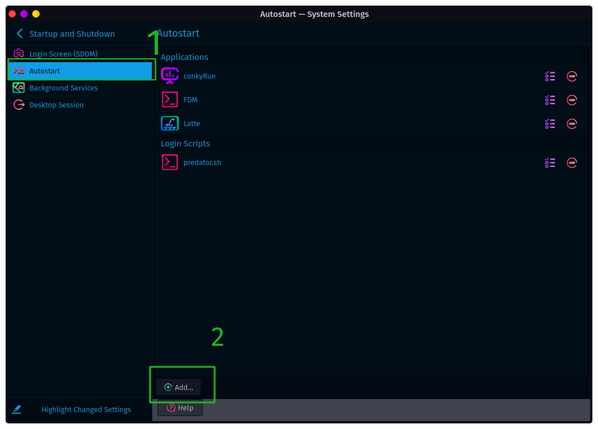

# Guide For <a href="https://github.com/brndnmtthws/conky"></a> Installation And  Customization

#### Conky Is a System Monitoring tool that Displays Hardware Information(i.g CPU, RAM, SWAP, GPU, SSD usage, etc.. ), can be customized as You like

## Installation

- Ubuntu/Debian (All Debian-based ) `sudo apt install -y conky`
- Garuda/ArchLinux (All ArchLinux-Based ) `sudo pacman -S conky`
- Fedora `sudo dnf install -y conky`
- OpenSUSE `sudo zypper install conky`
- CentOS
```
sudo yum install -y epel-release
sudo yum install -y conky
```
To run Conky open up terminal `conky` OR via Application Launcher 

### and here's conky 


#### Oh, Conky looks so bad!
#### No problem, we will customize it. We make it out of the box.

## [Conky Customization](https://wiki.archlinux.org/title/conky)
#### Here's [Conky Objects](http://conky.sourceforge.net/variables.html), we need it for Customization.
create configFIle for conky `.conf` let name it `conky.conf` and init `conky.conf`.
and here's configFile, you can change Variables as you like, you can change background, border width, etc..

#### Variable.
- `alignment` to determine position on screen (e.g on top or top right or top middle or bottom  eft).
- `background` to set background.
- `display` if you have a dual/multi setup monitor, you can Specify which display to connect to.
    - to list monitors use this command `xrandr --query | grep '\bconnected\b'`
    - I have a dual setup monitor, and here's my output
     ```
     eDP-1 connected primary 1920x1080+0+0 (normal left inverted right x axis y axis) 344mm x 193mm
     HDMI-1-0 connected 1920x1080+1920+0 (normal left inverted right x axis y axis) 531mm x 299mm
     ```
     
- Graph (show cpu/memory/gpu usage graph )
  - `cpugraph` CPU usage graph.
  - `gpugraph` GPU usage graph.
  - `memgraph` Memory usage graph.

- `font` to set the font you want

read [conky configuration settings](http://conky.sourceforge.net/config_settings.html) to know Variables and changing them.

### [Conky Config Files](conkyConfigFiles/).
this [conky.conf](conkyConfigFiles/conky.conf) is my config file that I'm using right now.
#
## Creating New Desktop Entry for Customized Conky.
### [Script](Scripts/) I have written these scripts for you so you don't get confused
to run conky with Customized config file `conky -c conky.conf` .

let's create desktop entry run this simple script with root permission [createDesktopEntry.sh](https://github.com/mmsaeed509/My-Linux-Customization/blob/main/Customization/Conky/Scripts/createDesktopEntry.sh) to create new desktop entry.
- download script.
- download config file.
- Run script `chmod +x createDesktopEntry.sh && ./createDesktopEntry.sh`

or create desktop entry via GUI from *** Menu Editor***


#### naming desktop entry 


#### execution command `cd ~/Public/conky && bash conky.sh`


#### Icon


#### search `conky`


#### Save :smiley:


#
 ## Run Conky on Startup
 run this [script](https://github.com/mmsaeed509/My-Linux-Customization/blob/main/Customization/Conky/Scripts/conkyStartup.sh) `./conkyStartup.sh`

or create desktop entry via GUI from *** System Setting***





