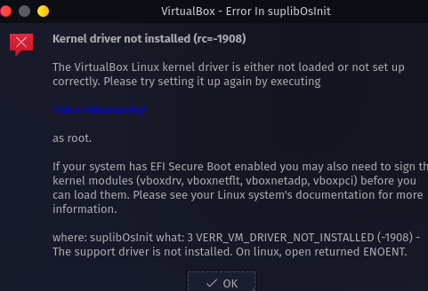

# here I give solutions for Issues that I had been faced in GNU/Linux distros

## Table Of Content
- [blur screen on VBox](#get-a-blur-screen-when-switching-to-full-screen-mode).
- [the virtualbox linux kernel driver is either not loaded or not set up correctly](#kernel-issue).
- [PGP key error](#pgp-key-error)

#### get a blur screen when switching to full screen mode 


here's the solution system setting > window management > KWin Scripts > Force Blur (disable it)


#

#### kernel issue 



> :warning: **make sure you install the right kernel modules**
> `virtualbox-host-dkms` or `virtualbox-host-modules-arch` [read](https://wiki.archlinux.org/title/VirtualBox#Installation_steps_for_Arch_Linux_hosts)

in my case `virtualbox-host-dkms` is the right kernel modules

open up the terminal execute this command 
```bash 
sudo vboxreload
```
 #### PGP key error
 
 When you update your system or install a tool, you may encounter this problem
 
 ```bash
 
 error: archlinux-keyring: key "0429897DE5F3BDAC537A30696D42BDD116E0068F" is unknown
:: Import PGP key 0429897DE5F3BDAC537A30696D42BDD116E0068F? [Y/n] 
error: key "0429897DE5F3BDAC537A30696D42BDD116E0068F" could not be looked up remotely
:: File /var/cache/pacman/pkg/archlinux-keyring-20200820-1-any.pkg.tar.zst is corrupted (invalid or corrupted package (PGP signature)).
Do you want to delete it? [Y/n] n
error: failed to commit transaction (invalid or corrupted package (PGP signature))
Errors occurred, no packages were upgraded.

```

and here is the solution

open up terminal 

```bash
sudo pacman -Sy archlinux-keyring chaotic-keyring

```
